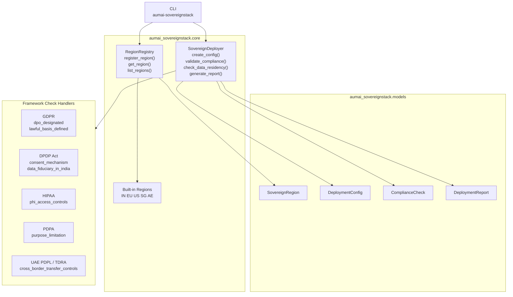

# aumai-sovereignstack

> Sovereign AI deployment toolkit — deploy AI systems with data residency controls, jurisdiction compliance, and national sovereignty requirements.

[](https://github.com/aumai/aumai-sovereignstack/actions)
[](https://pypi.org/project/aumai-sovereignstack/)
[](LICENSE)
[](https://python.org)

Part of the [AumAI](https://github.com/aumai) open-source ecosystem for agentic AI infrastructure.

---

## What is this?

`aumai-sovereignstack` is a **compliance-as-code engine for AI deployments in regulated jurisdictions**. It answers the question: "If I deploy this AI system in India, the EU, the UAE, Singapore, or the US, what rules must I follow — and do my current deployment settings satisfy them?"

Think of it as a **pre-flight checklist** that your CI/CD pipeline runs before any AI system goes live in a jurisdiction-sensitive context. You describe your deployment as a `DeploymentConfig` — what it is named, what region it targets, how its infrastructure is configured, and what data handling policies are in place. `SovereignDeployer.generate_report()` runs every applicable compliance check for that region and produces a `DeploymentReport` telling you exactly what passed, what failed, and which regulatory framework each check belongs to.

Pre-built region definitions cover five major jurisdictions out of the box:

| Code | Region | Data Residency | Frameworks |
|---|---|---|---|
| IN | India | Required | DPDP Act 2023, IT Act 2000, RBI Data Localisation |
| EU | European Union | Required | GDPR, EU AI Act, NIS2 Directive |
| AE | United Arab Emirates | Required | UAE PDPL, TDRA Cloud Regulations, DIFC PDPL |
| SG | Singapore | Not required | PDPA, MAS TRM, CSA Cybersecurity Act |
| US | United States | Not required | CCPA, HIPAA, FedRAMP, SOC 2 |

Additional regions can be registered with `RegionRegistry.register_region()`.

---

## Why does this matter?

### Sovereignty is non-negotiable for enterprise AI

Every enterprise operating across borders faces a hard constraint: some governments require that citizen data physically never leave their territory (data residency), and some require specific technical controls as a condition of operating at all. GDPR fines run to 4% of global annual turnover. DPDP penalties in India can reach INR 250 crore per violation. Compliance is not optional.

### Compliance drift is silent and expensive

A deployment that was compliant on launch day can drift out of compliance when a new policy key is removed from a config file. `aumai-sovereignstack` makes compliance a machine-verifiable property of a deployment configuration, not a document sitting in a compliance officer's drawer.

### Sovereignty shifts power dynamics in AI procurement

Governments and regulated industries increasingly demand sovereign AI — systems that run entirely within their jurisdiction, under their legal framework, without sending data to foreign clouds. `aumai-sovereignstack` provides the primitives to reason about, enforce, and report on those requirements programmatically.

---

## Architecture



---

## Features

- **Five pre-built sovereign regions** — India, EU, US, Singapore, UAE with correct compliance frameworks and data residency flags
- **Extensible region registry** — add custom regions or override existing ones with `register_region()`
- **Automated framework-specific checks** — GDPR (DPO, lawful basis), DPDP Act (consent mechanism, data fiduciary), HIPAA (PHI access controls), PDPA (purpose limitation), UAE PDPL/TDRA (cross-border transfer controls)
- **Universal data residency check** — verifies `data_policies["data_residency"] is True` for any region that requires it
- **Single-call report generation** — `generate_report()` returns a `DeploymentReport` with all check results and a top-level `all_compliant` boolean
- **CI/CD-friendly CLI** — exits with code 1 on compliance failure, enabling blocking pipeline gates
- **Machine-readable JSON output** — `compliance` command emits JSON arrays for downstream tooling
- **Pydantic models throughout** — all models validated at construction time

---

## Quick Start

### Installation

```bash
pip install aumai-sovereignstack
```

### List available regions

```bash
aumai-sovereignstack regions --list
```

```
[AE] United Arab Emirates  (data-residency-required)
  Frameworks: UAE PDPL, TDRA Cloud Regulations, DIFC PDPL
[EU] European Union  (data-residency-required)
  Frameworks: GDPR, EU AI Act, NIS2 Directive
[IN] India  (data-residency-required)
  Frameworks: DPDP Act 2023, IT Act 2000, RBI Data Localisation
[SG] Singapore  (no-residency-req)
  Frameworks: PDPA, MAS TRM, CSA Cybersecurity Act
[US] United States  (no-residency-req)
  Frameworks: CCPA, HIPAA, FedRAMP, SOC 2
```

### Run a compliance check

Create `deploy-eu.json`:

```json
{
  "name": "eu-healthcare-assistant",
  "region": {
    "region_id": "eu",
    "name": "European Union",
    "country_code": "EU",
    "data_residency_required": true,
    "compliance_frameworks": ["GDPR", "EU AI Act", "NIS2 Directive"]
  },
  "infrastructure": {
    "provider": "on-premise",
    "data_center": "Frankfurt"
  },
  "model_configs": [
    {"model": "llama-3-8b", "quantization": "int8", "max_tokens": 2048}
  ],
  "data_policies": {
    "data_residency": true,
    "data_protection_officer": "dpo@example.eu",
    "lawful_basis": "legitimate_interest"
  }
}
```

```bash
aumai-sovereignstack deploy --config deploy-eu.json
```

```
Deployment: eu-healthcare-assistant  [PASS]
Region: European Union (EU)
Total checks: 3

  [OK] data_residency_enforced (Data Residency)
       data_policies['data_residency'] is set to True — compliant.
  [OK] gdpr_dpo_designated (GDPR)
       Data Protection Officer is designated.
  [OK] gdpr_lawful_basis_defined (GDPR)
       Lawful basis for processing is defined.
```

### Machine-readable output

```bash
aumai-sovereignstack compliance --config deploy-eu.json | python -m json.tool
```

---

## CLI Reference

### `aumai-sovereignstack deploy`

Generate a human-readable compliance report. Exits with code 0 if all checks pass, code 1 if any fail.

```
Options:
  --config PATH   Path to a JSON deployment config file.  [required]
```

**Example:**

```bash
aumai-sovereignstack deploy --config deploy-in.json
```

---

### `aumai-sovereignstack compliance`

Run compliance checks and emit results as a JSON array. Exits with code 1 if any check fails. Useful for piping into `jq` or other tooling.

```
Options:
  --config PATH   Path to a JSON deployment config file.  [required]
```

**Example:**

```bash
# Show only failing checks
aumai-sovereignstack compliance --config deploy-sg.json | python -c \
  "import json,sys; [print(c) for c in json.load(sys.stdin) if not c['passed']]"
```

---

### `aumai-sovereignstack regions`

List all registered sovereign regions or look up one by ISO country code.

```
Options:
  --list           List all registered regions.
  --country TEXT   Look up a region by ISO country code (e.g. IN, EU, US, SG, AE).
```

**Examples:**

```bash
aumai-sovereignstack regions --list
aumai-sovereignstack regions --country IN
aumai-sovereignstack regions --country EU
```

---

## Python API

### Explore built-in regions

```python
from aumai_sovereignstack import RegionRegistry

registry = RegionRegistry()

eu = registry.get_region("EU")
print(eu.name)                       # "European Union"
print(eu.data_residency_required)    # True
print(eu.compliance_frameworks)      # ['GDPR', 'EU AI Act', 'NIS2 Directive']

for region in registry.list_regions():
    print(region.country_code, region.name)
```

### Register a custom region

```python
from aumai_sovereignstack import SovereignRegion

registry.register_region(SovereignRegion(
    region_id="jp",
    name="Japan",
    country_code="JP",
    data_residency_required=False,
    compliance_frameworks=["APPI", "Cybersecurity Basic Act"],
))
jp = registry.get_region("JP")
print(jp.compliance_frameworks)  # ['APPI', 'Cybersecurity Basic Act']
```

### Create a deployment configuration

```python
from aumai_sovereignstack import SovereignDeployer

deployer = SovereignDeployer()
eu = registry.get_region("EU")

config = deployer.create_config(
    name="eu-document-ai",
    region=eu,
    infrastructure={"provider": "on-premise", "data_center": "Amsterdam"},
    model_configs=[{"model": "llama-3-70b", "serving": "vllm"}],
    data_policies={
        "data_residency": True,
        "data_protection_officer": "privacy@company.eu",
        "lawful_basis": "consent",
    },
)
```

### Validate compliance

```python
checks = deployer.validate_compliance(config)
for check in checks:
    status = "PASS" if check.passed else "FAIL"
    print(f"[{status}] {check.check_name} ({check.framework})")
    print(f"       {check.details}")
```

### Generate a full report

```python
report = deployer.generate_report(config)
print("All compliant:", report.all_compliant)

for check in report.compliance_results:
    if not check.passed:
        print("FAILED:", check.check_name, "-", check.details)
```

### India DPDP Act deployment

```python
india = registry.get_region("IN")
india_config = deployer.create_config(
    name="in-financial-agent",
    region=india,
    data_policies={
        "data_residency": True,
        "consent_mechanism": "explicit_opt_in",
    },
)
report = deployer.generate_report(india_config)
print("DPDP compliant:", report.all_compliant)
```

### US HIPAA deployment

```python
us = registry.get_region("US")
hipaa_config = deployer.create_config(
    name="us-clinical-notes-ai",
    region=us,
    data_policies={
        "phi_access_controls": "role_based_with_audit_log",
    },
)
report = deployer.generate_report(hipaa_config)
for check in report.compliance_results:
    print(check.check_name, "->", "OK" if check.passed else "FAIL")
```

---

## Compliance Framework Coverage

| Region | Framework | Automated Check | Policy Key Required |
|---|---|---|---|
| EU | GDPR | DPO designated | `data_protection_officer` |
| EU | GDPR | Lawful basis defined | `lawful_basis` |
| EU | EU AI Act | Acknowledged | — |
| EU | NIS2 Directive | Acknowledged | — |
| India | DPDP Act 2023 | Consent mechanism | `consent_mechanism` |
| India | DPDP Act 2023 | India-region data fiduciary | region must be `IN` |
| India | IT Act 2000 | Acknowledged | — |
| India | RBI Data Localisation | Acknowledged | — |
| US | HIPAA | PHI access controls | `phi_access_controls` |
| US | CCPA / FedRAMP / SOC 2 | Acknowledged | — |
| Singapore | PDPA | Purpose limitation | `purpose_limitation` |
| Singapore | MAS TRM / CSA | Acknowledged | — |
| UAE | UAE PDPL / TDRA | Cross-border transfer controls | `cross_border_transfer_controls` |
| UAE | DIFC PDPL | Acknowledged | — |
| Any (residency) | Data Residency | `data_residency == True` | `data_residency` |

"Acknowledged" checks always pass and log that the framework was considered, making it easy to audit which frameworks were evaluated even before automated checks are added.

---

## How It Works

### RegionRegistry

Holds a `dict[str, SovereignRegion]` keyed by uppercase ISO country code. Five regions are pre-populated at construction time. `register_region()` is an upsert. `list_regions()` returns a list sorted by `region_id` for deterministic output.

### SovereignDeployer

`validate_compliance()` always runs `check_data_residency()` first, then iterates `config.region.compliance_frameworks` and dispatches each framework to a handler via substring match on the uppercase framework name. Unknown frameworks receive a single passing "acknowledged" check. `generate_report()` calls `validate_compliance()`, evaluates `all()` over results, and returns a `DeploymentReport`.

### data_policies dictionary

The `data_policies: dict[str, object]` field of `DeploymentConfig` is the primary input for automated checks. Each check looks for a specific key using `config.data_policies.get(key)` and tests truthiness. A missing key or a falsy value causes that check to fail.

---

## Integration with Other AumAI Projects

| Project | Integration |
|---|---|
| `aumai-datacommons` | Tag datasets with `SovereignRegion` metadata to enforce data residency at the storage layer |
| `aumai-agentmarket` | Filter the agent marketplace to agents certified for a specific jurisdiction |
| `aumai-specs` | Embed `DeploymentConfig` schemas into API contract definitions for sovereign services |

---

## Documentation

- [Getting Started](docs/getting-started.md)
- [API Reference](docs/api-reference.md)
- [Examples](examples/)
- [Contributing](CONTRIBUTING.md)

---

## Contributing

See [CONTRIBUTING.md](CONTRIBUTING.md). All contributions require type hints on every function signature, tests alongside implementation (pytest + hypothesis), `ruff` and `mypy --strict` passing, and conventional commit messages (`feat:`, `fix:`, `refactor:`, `docs:`, `test:`, `chore:`).

---

## License

Apache 2.0 — see [LICENSE](LICENSE) for details.

---

## Part of AumAI

This project is part of [AumAI](https://github.com/aumai) — open source infrastructure for the agentic AI era.
